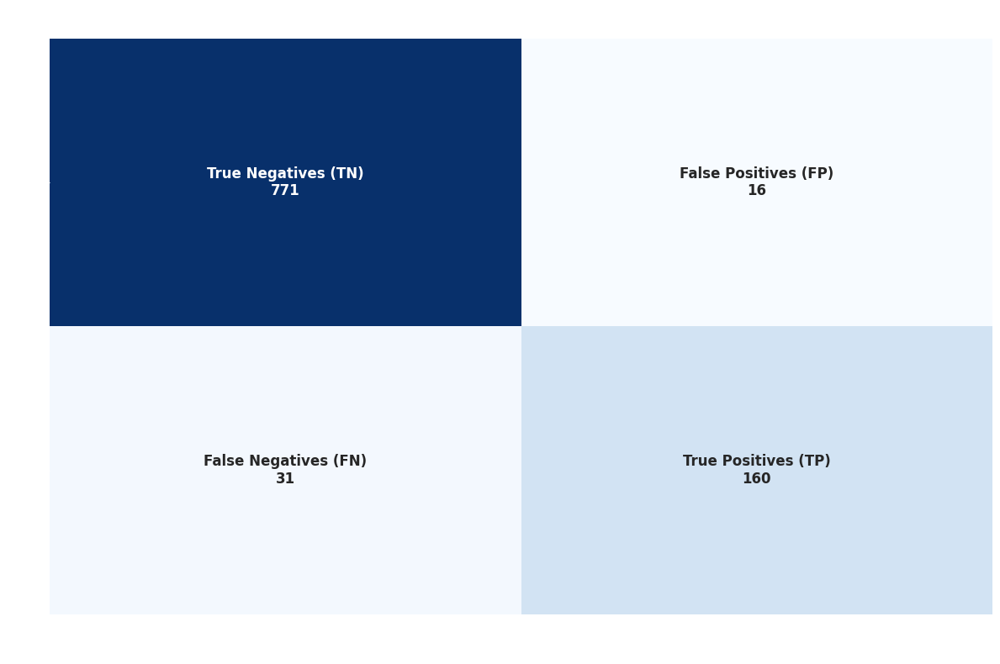
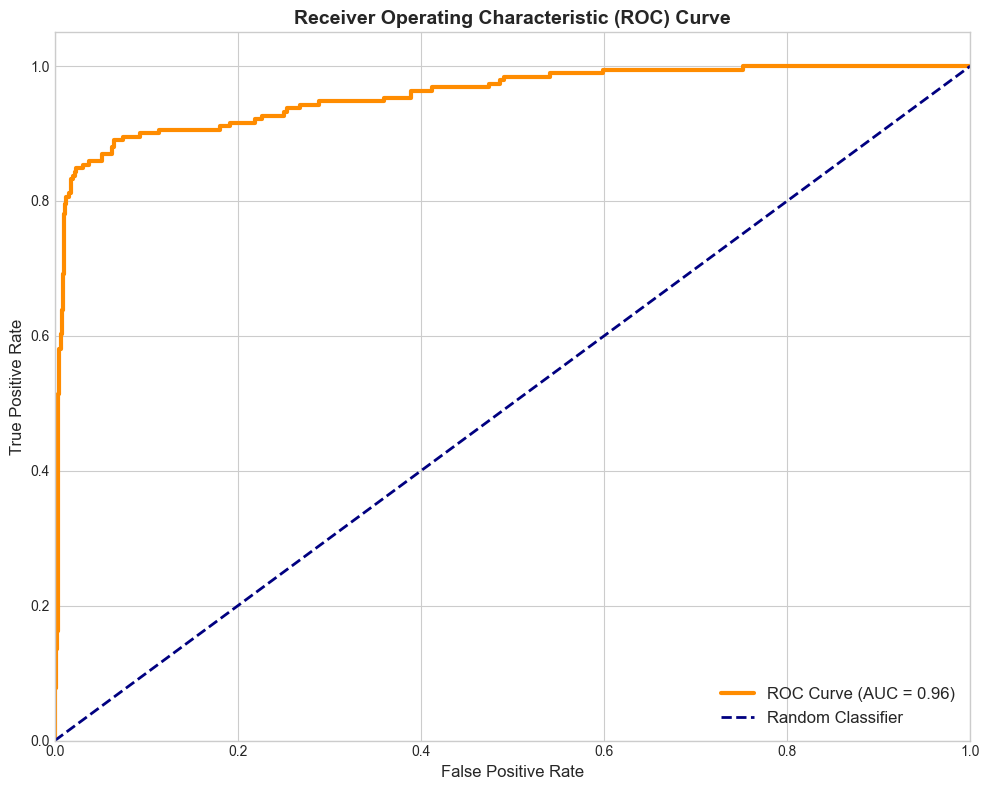
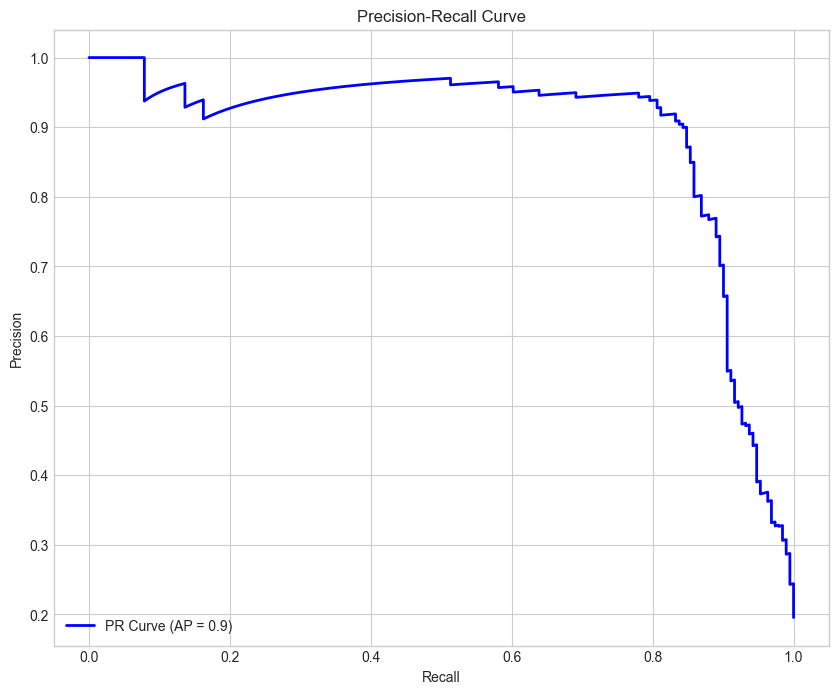

 <!-- Core Languages & ML -->       <!-- Libraries -->       <!-- Backend / APIs -->   <!-- Cloud & DevOps -->    <!-- Apps & Tools -->     <!-- Deployment --> 

# WanderWells Travels – Customer Propensity Modeling

*Predicting which customers are most likely to purchase the “Bliss Retreat Wellness Package” using data-driven insights.*

---

## 🌍 Project Overview

WanderWells Travels, a rapidly growing luxury travel company, aims to revolutionize customer targeting for its newest offering — the Zen Escape Wellness Package 🧘‍♀️✨

Previously, marketing campaigns reached customers randomly, leading to high costs and low conversion rates (~19 %).

This project uses machine learning and data analytics to identify which customers are most likely to purchase the new package — helping the marketing team work smarter, not harder.

### 🚀 Live Demo

---

## 📊 About the Data

*Dataset Link*

[Tour Package Prediction Dataset on Kaggle](https://www.kaggle.com/datasets/sanamps/tourpackageprediction)

The dataset contains information about customer demographics, behavior, and interactions with the sales team.

The dataset was stored on AWS S3

---

## 🎯 Objective

To build a predictive model that classifies potential customers into two groups:

* Likely to Purchase 🟢

* Not Likely to Purchase 🔴

This helps the marketing team focus resources on the most promising leads, thereby reducing costs and boosting sales.

---

## 📊 Model Performance Results

Performance on Test Set

- Accuracy: 0.95

- F1 Score: 0.87

- Precision: 0.91

- Recall: 0.84

| Class            | Precision | Recall | F1-Score | Support |
| ---------------- | --------- | ------ | -------- | ------- |
| **0**            | 0.96      | 0.98   | 0.97     | 787     |
| **1**            | 0.91      | 0.84   | 0.87     | 191     |
| **Accuracy**     |           |        | 0.95     | 978     |
| **Macro Avg**    | 0.94      | 0.91   | 0.92     | 978     |
| **Weighted Avg** | 0.95      | 0.95   | 0.95     | 978     |

### Business Impact:

Model-selected leads convert at ~91% vs. the original 19% baseline,
delivering a : 

- ⭐ → 4.7× uplift in conversion efficiency

- Confusion Matrix

- ROC-AUC Curve

- P-R Curve

---

🔧 Project Workflow

1. 🔍 Exploratory Data Analysis (EDA)

2. 🧹 Data Preprocessing & Feature Engineering

3. ⚙️ Model Training & Evaluation

4. 🚀 FastAPI Backend for Model Prediction

5. 🐳 Dockerized Model Deployment

6. ☁️ Deployment on AWS EC2

XGBOOST CLASSIFIER was selected as the best-performing classifier model after hyperparameter tuning. 

---

## 🐳 Docker Hub Registry

---

## 🖥️ Tech Stack

| Category                 | Tools                                            |
| ------------------------ | ------------------------------------------------ |
| **Programming Language** | Python 3.13                                      |
| **Frameworks**           | FastAPI, Streamlit                               |
| **Libraries**            | Pandas, NumPy, Scikit-learn, Matplotlib, Seaborn, XGBoost |
| **Deployment**           | Docker, AWS EC2                                  |
| **Version Control**      | Git & GitHub                                     |
| **Data Validation**      | Pydantic                                         |
| **IDE**                  | Visual Studio Code, Jupyter Notebook             |

---

## 🏆 Conclusion

This project demonstrates how data-driven marketing can significantly reduce cost and increase conversions in the travel industry.
With predictive modeling, WanderWells Travels can now target the right customers at the right time, enhancing both customer satisfaction and business revenue.

---

## 👨‍💻 Author

Sarthak Sharma

Data Science Student  |  Machine Learning  |  Deep Learning  |   NLP  |  GenAI

